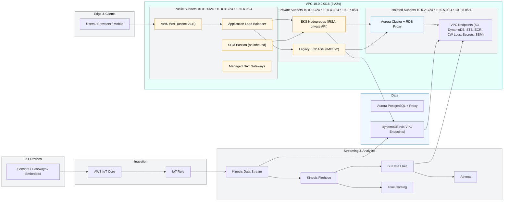

```
       _       _     _   _           _           _                           
      / \   __| | __| | | |__   ___ | |_ ___  __| | ___  ___  ___  _ __ ___  
     / _ \ / _` |/ _` | | '_ \ / _ \| __/ _ \/ _` |/ _ \/ __|/ _ \| '__/ _ \ 
    / ___ \ (_| | (_| | | | | | (_) | ||  __/ (_| |  __/\__ \ (_) | | |  __/ 
   /_/   \_\__,_|\__,_| |_| |_|\___/ \__\___|\__,_|\___||___/\___/|_|  \___| 
```

# aws-hestia-system-demo Infrastructure as Code

## Overview
The **aws-hestia-system-demo** repository delivers a production-ready Terraform implementation of a resilient IoT reference architecture. It spans secure device ingestion, streaming analytics, containerized microservices, and legacy workloads—all converging on a shared, highly-available AWS footprint in the `ap-southeast-1` region. The project embraces modular Terraform, GitOps-driven pipelines, and opinionated defaults to accelerate platform teams standing up multi-environment AWS IoT solutions.

Key goals:
- Codify a **multi-environment landing zone** (dev, stage, prod) with consistent tagging and governance.
- Provide reusable Terraform modules for **VPC, IoT Core, Kinesis, DynamoDB, Aurora, EKS, ALB, EC2, S3, and VPC endpoints**.
- Demonstrate secure defaults: private EKS API endpoints, encrypted data stores, IRSA, SSM Session Manager access, and TLS-enforced ingress.
- Automate validation, planning, application, and drift detection via GitHub Actions.

## High-level Architecture


## Networking Layout
Each environment provisions a tri-zonal VPC with:
- **Public subnets**: NAT gateways and ingress routing for ALB and SSM bastion.
- **Private subnets**: Workloads (EKS node groups, legacy EC2 ASG) with egress through NAT.
- **Isolated subnets**: Data tier (Aurora cluster, RDS proxy) and VPC endpoints without Internet exposure.
- **Flow logs** captured to CloudWatch Logs and encrypted with customer-managed KMS keys.
- **Interface and gateway endpoints** for S3, DynamoDB, STS, ECR, CloudWatch Logs, Secrets Manager, and the SSM suite—ensuring private service connectivity.

## Module Catalogue
| Module | Description | Key Highlights |
|--------|-------------|----------------|
| `modules/vpc` | VPC, subnets, routing, NAT, flow logs | Multi-AZ design, optional NAT per AZ, encrypted logs |
| `modules/endpoints` | Gateway + interface VPC endpoints | Central SG, per-service configuration |
| `modules/s3` | Telemetry, firmware, logs buckets | Deterministic naming, lifecycle + SSE-KMS |
| `modules/rds` | Aurora PostgreSQL + proxy | Secrets Manager integration, IAM proxy role |
| `modules/dynamodb` | Telemetry store | TTL, streams, optional GSIs |
| `modules/kinesis` | Data stream + Firehose + Glue | JSON→Parquet conversion, encrypted delivery |
| `modules/eks` | Private EKS cluster + addons | Managed node group, IRSA, ALB controller, autoscaler, Fluent Bit |
| `modules/alb` | Shared ingress ALB + WAF | Dual target groups, TLS 1.3, AWS WAF attachment |
| `modules/ec2` | SSM bastion + legacy ASG | IMDSv2 enforced, SSM-only access |
| `modules/iot` | IoT Core policy + rule + JITP | Kinesis integration, provisioning template |

## Environment Promotion Workflow
1. **dev** – rapid iteration, feature validation, telemetry replay.
2. **stage** – pre-production soak testing, mirrors prod configuration with reduced scale.
3. **prod** – highly available deployment with manual approvals and controlled applies.

Promotion steps:
- Merge feature branches → PR runs lint and plan.
- After approval, merge to `main` triggers staged applies (prod stack matrix) gated by GitHub Environment approval.
- Stage drift detection nightly ensures parity with code.

## Security & Compliance Highlights
- **Least privilege IAM** roles with scoped actions for IoT rules, Firehose, RDS Proxy, and autoscaler IRSA service accounts.
- **KMS everywhere**: S3 buckets, Aurora, DynamoDB, Firehose, CloudWatch logs, EBS volumes.
- **Private EKS endpoint** and IRSA-managed addon permissions.
- **Session Manager bastion**—no inbound SSH.
- **AWS WAF** fronting the ALB with managed rule groups.
- **Default tagging**: `App`, `Env`, `Owner`, `ManagedBy` promote FinOps visibility.

## CI/CD Flow
1. **Lint job**: `terraform fmt`, `tflint`, `tfsec` ensure code quality.
2. **Plan job** (PR): executes plans per dev stack, storing artifacts for review.
3. **Apply job** (main): applies prod stacks sequentially after manual approval (`environment: production`).
4. **Drift detection**: nightly scheduled plans with `-detailed-exitcode` highlight configuration drift.

## Operational Guide
### Prerequisites
- Terraform >= 1.9
- AWS credentials (programmatic) with access to target accounts.
- Optional: tflint, tfsec binaries for local linting.

### Bootstrap Remote State Backend
1. Create S3 bucket (versioned) `aws-hestia-system-demo-tfstate` in `ap-southeast-1`.
2. Create DynamoDB table `aws-hestia-system-demo-tf-locks` with primary key `LockID`.
3. Apply encryption and least-privilege IAM policies.

### Deploy Order
Follow the directed acyclic dependency graph per environment:
1. `make init plan apply STACK=vpc`
2. `make ... STACK=endpoints`
3. `make ... STACK=data`
4. `make ... STACK=eks`
5. `make ... STACK=ingress`
6. `make ... STACK=compute`

### Common Commands
- `make fmt` – format all Terraform files.
- `make plan ENV=stage STACK=eks`
- `make apply ENV=prod STACK=ingress`
- `make destroy ENV=dev STACK=compute`

## Troubleshooting
| Issue | Resolution |
|-------|------------|
| **State lock persists** | Check DynamoDB lock table; delete stale item if no apply in progress. |
| **AccessDenied (IoT rule)** | Verify IAM role `iot_provisioning` has trust relationship and policy attached. |
| **EKS Helm releases fail** | Ensure kubectl/Helm providers obtain tokens via AWS auth; rerun `terraform init -upgrade`. |
| **Kinesis Firehose delivery failures** | Confirm S3 bucket policy allows Firehose role, check CloudWatch delivery logs. |
| **RDS proxy auth issues** | Rotate Secrets Manager secret (`aws secretsmanager rotate-secret`) and rerun apply. |

## Cost Optimization Considerations
- Toggle NAT gateway count via `create_nat` flags per public subnet to reduce dev/stage costs.
- Use SPOT worker nodes by setting `node_capacity_type = "SPOT"` in lower environments.
- Adjust `aurora_instance_count` and `legacy_desired_capacity` per env-specific load.
- Lifecycle rules archive telemetry to Glacier after 180 days; adjust to match retention requirements.

## Future Extensions
- **Multi-region DR** leveraging Route 53 health checks and cross-region replication.
- **AWS IoT Device Defender** metrics & audits for fleet monitoring.
- **Edge ML inference** pipelines using AWS IoT Greengrass.
- **Service Mesh** integration (AWS App Mesh) layered on EKS workloads.
- **Secrets rotation pipelines** via AWS Secrets Manager rotation Lambdas.

## Repository Layout
```
infra/
├── modules/               # Reusable building blocks
├── live/
│   ├── dev/               # Dev environment stacks
│   ├── stage/             # Stage environment stacks
│   └── prod/              # Prod environment stacks
├── .github/workflows/     # CI/CD automation
├── Makefile               # Helper targets
├── .tflint.hcl / .tfsec.yml
└── README.md              # (this file)
```

## Conclusion
**AWS Hestia System Demo — your foundation for resilient IoT cloud infrastructure.**
